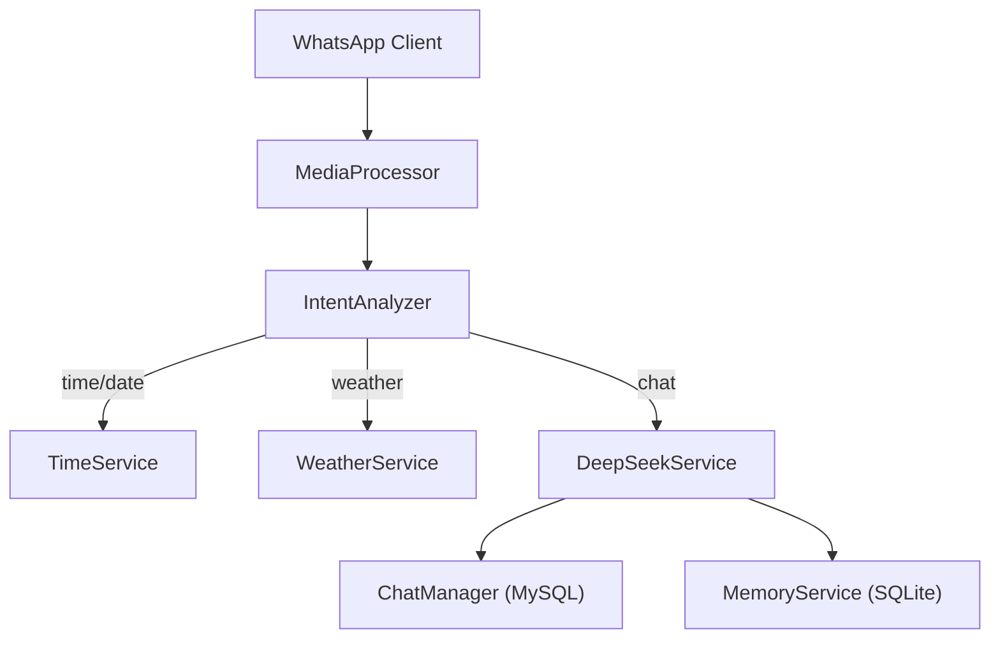
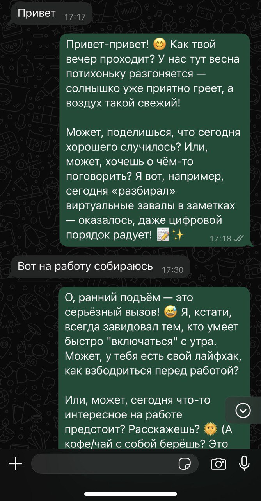
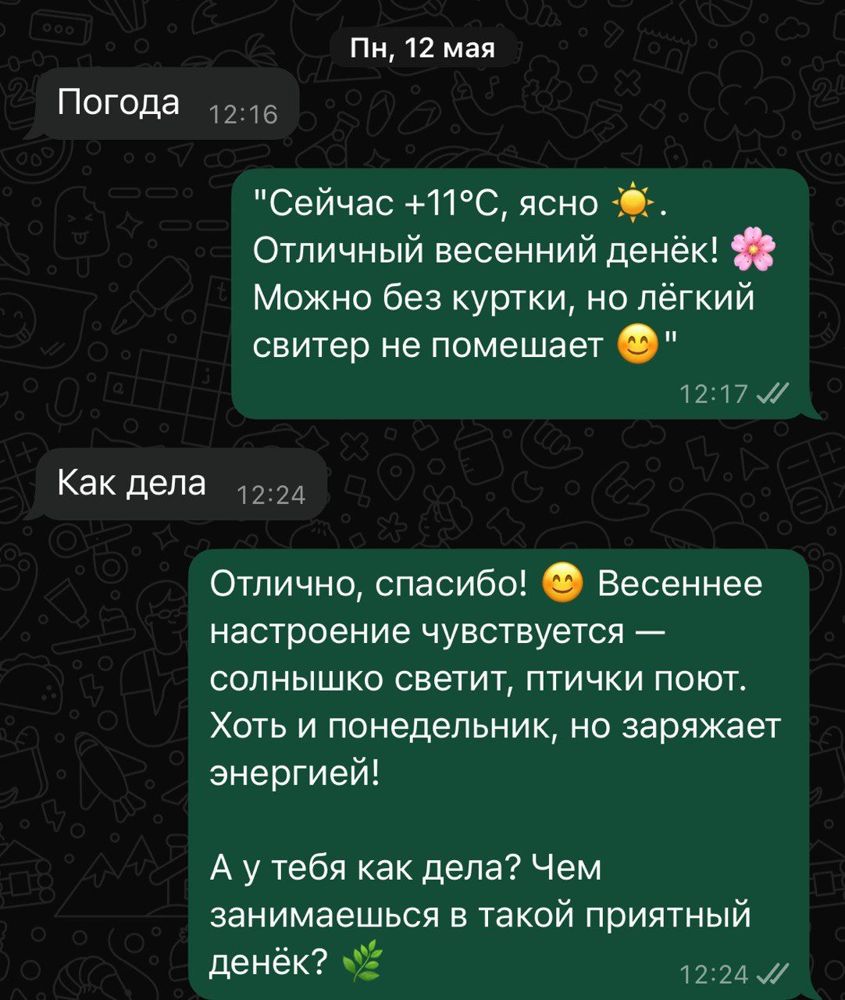

# 📱 WhatsApp ChatBot на базе LLM

[](https://github.com/username/whatsapp-chatbot/actions)
[](https://www.npmjs.com/package/whatsapp-chatbot)
[](https://opensource.org/licenses/MIT)

Интеллектуальный чат-бот для WhatsApp, объединяющий возможности больших языковых моделей (LLM), мультимедийную обработку и RAG-подход для "человечных" ответов.

> ⚠️ **Внимание:** Проект находится в активной стадии разработки. API и функциональность могут меняться.

---

## 📋 Содержание

1. [✨ Возможности](#-возможности)
2. [🏛 Архитектура](#-архитектура)
3. [🚀 Установка и запуск](#-установка-и-запуск)
4. [⚙️ Конфигурация](#️-конфигурация)
5. [🗂 Структура проекта](#-структура-проекта)
6. [🤝 Вклад](#-вклад)
7. [🔒 Лицензия](#-лицензия)

---

## ✨ Возможности

* **Текстовые ответы**: генерация через модель `deepseek-chat`.
* **Голосовые сообщения**: поддержка STT и TTS (Yandex SpeechKit).
* **Мультимедиа**: приём изображений, видео и аудио; хранение и классификация.
* **RAG-память**:

  * **Краткосрочная** на MySQL
  * **Долгосрочная**: SQLite + векторные эмбеддинги (`all-MiniLM-L6-v2`).
* **Анализ настроения и стиля**: авто-классификация входящих сообщений и подбор стиля ответов (tech, friendly, formal).
* **Сервисы времени и погоды**: текущее время, дата, прогноз погоды (OpenWeather).

---

## 🏛 Архитектура



1. **MediaProcessor**: загрузка и классификация медиа, STT/TTS
2. **IntentAnalyzer**: определение типа запроса
3. **TimeService** и **WeatherService**: вспомогательные ответы
4. **DeepSeekService**: формирование LLM-запроса, RAG-выборка
5. **ChatManager** и **MemoryService**: краткосрочная и долгосрочная память

---

## 🖼️ Скриншоты

Добавьте каталог `/docs/screenshots` в корне репозитория и разместите там примеры интерфейса и диалогов:

| Описание           | Пример                                                  |
| ------------------ | ------------------------------------------------------- |
| Пример диалога  |  |
| Пример диалога     |   |

---


## 🚀 Установка и запуск

1. **Клонировать репозиторий**

   ```bash
   git clone https://github.com/username/whatsapp-chatbot.git
   cd whatsapp-chatbot
   ```
2. **Установить зависимости**

   ```bash
   npm install
   ```
3. **Создать файл `.env`**

   ```ini
   MYSQL_HOST=
   MYSQL_USER=
   MYSQL_PASSWORD=
   SQLITE_PATH=./data/memory.sqlite
   YANDEX_API_KEY=
   OPENWEATHER_API_KEY=
   ```
4. **Запустить бота**

   ```bash
   npm start
   ```

---

## ⚙️ Конфигурация

Все параметры находятся в `config/index.js`:

* Папки для медиа и лога чата
* Лимиты истории сообщений
* Стильные профили ответов (TECHNICAL, FRIENDLY, FORMAL и др.)
* Алиасы городов для WeatherService

---

## 🗂 Структура проекта

```text
├─ index.js          # Точка входа и инициализация
├─ ChatManager.js    # MySQL-история чата
├─ MemoryService.js  # Векторная память (SQLite)
├─ DeepSeekService.js# Запросы к LLM
├─ MediaProcessor.js # Обработка медиа и STT/TTS
├─ TimeService.js    # Время и дата
├─ WeatherService.js # Погода
├─ IntentAnalyzer.js # Определение намерений
├─ MoodAnalyzer.js   # Классификация настроения
└─ StyleAnalyzer.js  # Анализ стиля взаимодействия
```

---

## 🤝 Вклад

PR и Issues приветствуются!

* Фичи и баг-репорты — в ветку `develop`.
* Описание изменений — в тексте PR.

---

## 🔒 Лицензия

Этот проект ©IgatikovAM
